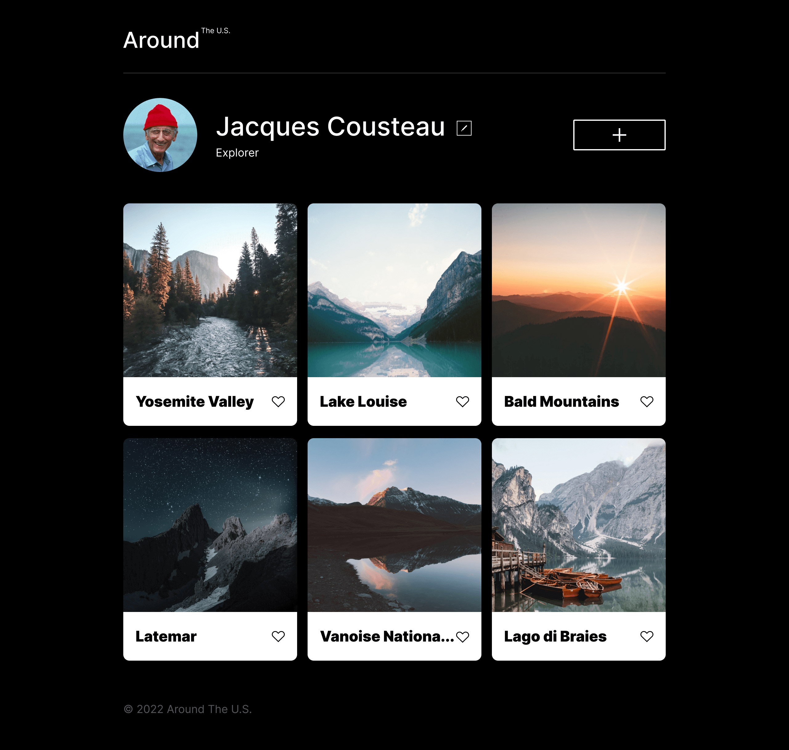
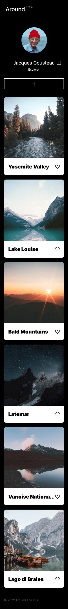

# Project 3: Around The U.S.

### Overview  

* Intro  
* Updates
* Figma 
* Images  
* Plans for Improvement
  
**Intro**
  
This project tests our abilities in responsize design.  A key step in becoming a truly badass UX developer.  Here we have applied the grid layout to a gallery of cards.  This gallery along with the contents of the header and the profile will adjust to various screen and browser sizes to allow for proper readability and functionality of many, many devices.   

**Updates 4-16-23**  
All recommended changes have been made since the last review.  Issues with @media changes and horizontal scroll have been resolved. 

**Figma**  
  
* [Link to the project on Figma](https://www.figma.com/file/ii4xxsJ0ghevUOcssTlHZv/Sprint-3%3A-Around-the-US?node-id=0%3A1)  
  
**Images**  
  
The way you'll do this at work is by exporting images directly from Figma — we recommend doing that to practice more. Don't forget to optimize them [here](https://tinypng.com/), so your project loads faster. 
  
Good luck and have fun!

**Plans for Improvement**
We will be using the same github repo for the next few sprints.  I assume speifically to add functionality to this website through the various buttons, widgets, etc.  Should be fun. 
